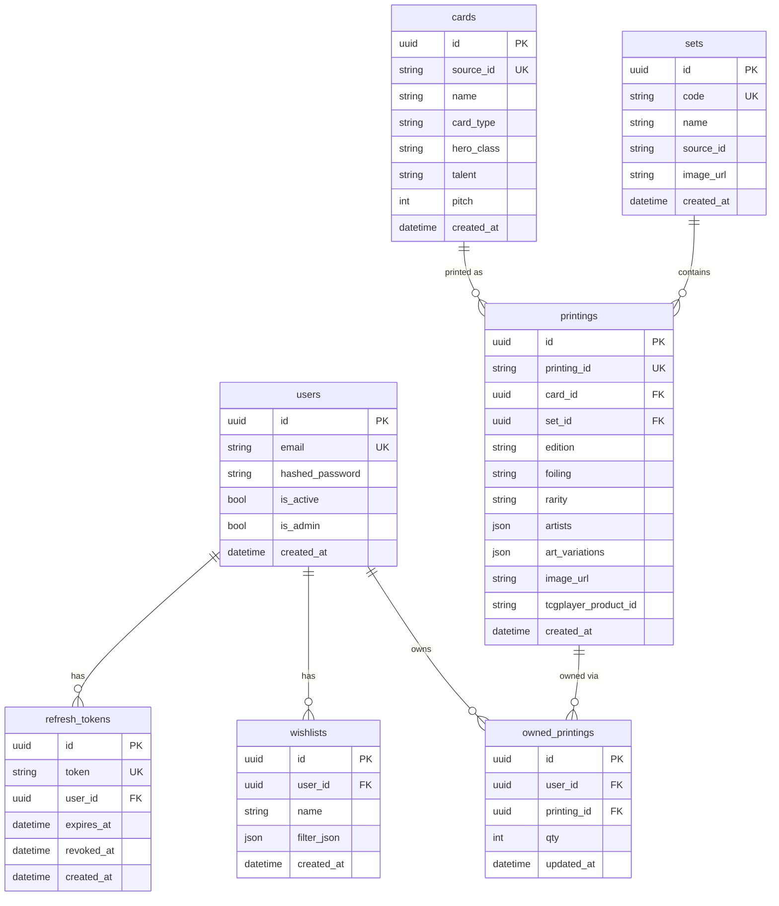

# FabGreat Library

> A full-stack Flesh & Blood TCG collection tracker built as a personal portfolio project.


Users can browse the full card catalog (92 sets, 4 200+ cards, 14 000+ printings), track which copies they own down to foiling and edition, and manage their collection via single-click or atomic bulk updates.

**Backend — complete** · **Frontend — in progress**

---

## Engineering highlights

- **Async throughout** — FastAPI + SQLAlchemy 2.0 async engine + asyncpg; no sync blocking anywhere in the request path.
- **JWT + refresh token rotation** — short-lived access tokens (15 min) paired with opaque DB-stored refresh tokens; logout revokes the token server-side.
- **Idempotent dataset import** — `make import-cards` downloads ~34 MB from a pinned GitHub release and upserts ~14 000 printings using `INSERT … ON CONFLICT DO UPDATE`. Safe to re-run at any time.
- **Atomic bulk mutations** — `POST /collection/bulk` validates all referenced printings exist before touching any row; the entire batch succeeds or nothing changes.
- **OpenAPI-first contract** — backend is the single source of truth; TypeScript types are generated from the OpenAPI schema, eliminating manual type duplication.
- **Strict test isolation** — each test opens a transaction that is rolled back on teardown; `db.commit` is patched to `db.flush` so route-level commits stay within the test transaction and never touch the real DB state.

---

## Architecture


---

## Data model



**Key design decision — Strategy B:** the source dataset represents each foiling of a card as a separate entry. The `printings` table mirrors this directly: one row = one specific foiling + edition combination. This keeps the ownership model simple — `(user_id, printing_id)` is the unique key with no need for a separate foil-type column.

---

## API

<details>
<summary><strong>Auth</strong></summary>

| Method | Path | Auth | Description |
|---|---|---|---|
| POST | `/auth/register` | — | Create account, returns access + refresh tokens |
| POST | `/auth/token` | — | Login (OAuth2 password flow) |
| POST | `/auth/refresh` | — | Rotate refresh token |
| POST | `/auth/logout` | Bearer | Revoke refresh token server-side |
| GET | `/auth/me` | Bearer | Current user profile |

</details>

<details>
<summary><strong>Card catalog (public)</strong></summary>

| Method | Path | Description |
|---|---|---|
| GET | `/sets` | All sets with `printing_count`; adds `owned_count` when authenticated |
| GET | `/sets/{id}/printings` | Printings in a set — paginated, filterable by `q`, `rarity`, `foiling`, `edition`, `hero_class`, `talent`, `card_type` |
| GET | `/cards` | Card list — filterable by `name`, `hero_class`, `talent`, `pitch`, `set_code` |
| GET | `/cards/{id}` | Card detail with all printings and set info |
| GET | `/search/printings` | Cross-set printing search with all filters above |

</details>

<details>
<summary><strong>Collection (requires auth)</strong></summary>

| Method | Path | Description |
|---|---|---|
| GET | `/collection/summary` | Owned printings with full card/set detail; `?set_id=` to scope to one set |
| POST | `/collection/items` | Upsert `{printing_id, qty}` — qty 0 deletes the row |
| POST | `/collection/bulk` | Atomic batch with actions: `set_qty` · `increment` · `mark_playset` (qty=3) · `clear` |

</details>

Interactive docs available at **http://localhost:8000/docs** when running locally.

---

## Tech stack

| Layer | Technology |
|---|---|
| API framework | FastAPI 0.100+ |
| ORM | SQLAlchemy 2.0 (fully async) |
| Database | PostgreSQL 15 via asyncpg |
| Migrations | Alembic |
| Auth | python-jose (JWT) + bcrypt |
| Validation | Pydantic v2 |
| Frontend | Next.js 16 (App Router) |
| Styling | Tailwind CSS v4 + shadcn/ui |
| Data fetching | TanStack Query v5 |
| Types | Generated from OpenAPI via openapi-typescript |
| Testing | pytest-asyncio — 60+ tests |
| Containerisation | Docker Compose |

---

## Getting started

**Prerequisites:** Python 3.11+, Node.js 20+, Docker Compose v2, `make`

```bash
# 1. Environment
cp .env.example .env
cp apps/web/.env.local.example apps/web/.env.local

# 2. Start Postgres
make up

# 3. Dependencies + migrations
make install
make migrate

# 4. Import the full card dataset (~14 000 printings, idempotent)
make import-cards

# 5. Start both servers
make api-dev   # :8000 — hot reload
make web-dev   # :3000 — hot reload (new terminal)
```

```bash
# Run tests (Postgres must be running)
make test
```

> **Windows:** install `make` with `winget install GnuWin32.Make` and restart Git Bash.

---

## Project structure

```
FabGreatLibrary/
├── apps/
│   ├── api/                        FastAPI backend
│   │   ├── app/
│   │   │   ├── core/               Config, JWT, FastAPI dependencies
│   │   │   ├── db/                 ORM models (7 tables), async session
│   │   │   ├── routers/            auth · sets · cards · search · collection
│   │   │   ├── schemas/            Pydantic request/response models
│   │   │   └── services/           Business logic — no SQL in routers
│   │   ├── scripts/
│   │   │   ├── import_cards.py     Dataset importer (idempotent upsert)
│   │   │   └── seed.py             Dev seed data
│   │   ├── alembic/                DB migrations
│   │   └── tests/                  60+ tests, per-test transaction rollback
│   └── web/                        Next.js 16 (App Router)
│       ├── app/                    Pages
│       ├── components/ui/          shadcn/ui components
│       └── lib/                    API client, utilities
├── packages/types/                 Generated TypeScript types (OpenAPI)
├── infra/docker/                   docker-compose.yml
├── Makefile
└── .env.example
```

---

## Build progress

| Phase | Status | Deliverable |
|---|---|---|
| 0 — Scaffold | ✅ | Monorepo, Docker, Makefile, FastAPI skeleton, Next.js landing page |
| 1 — Domain | ✅ | ORM models, Alembic migrations, seed script, wishlist service |
| 2 — Auth | ✅ | Register, login, refresh token rotation, logout, `/me` |
| 3 — Catalog | ✅ | `GET /cards`, `GET /cards/{id}`, `GET /sets` |
| 4 — Browse | ✅ | Set printings, cross-set search, per-field filtering |
| 5 — Collection | ✅ backend | Summary, single upsert, atomic bulk actions |
| 5 — Collection | 🔄 frontend | Set grid UI, click-to-increment, bulk select |
| 6 — Wishlists | 🔜 | Saved filter views (free tier: 1 per user) |
| 7 — Types | 🔜 | Generated TS client from OpenAPI, wired into frontend |
