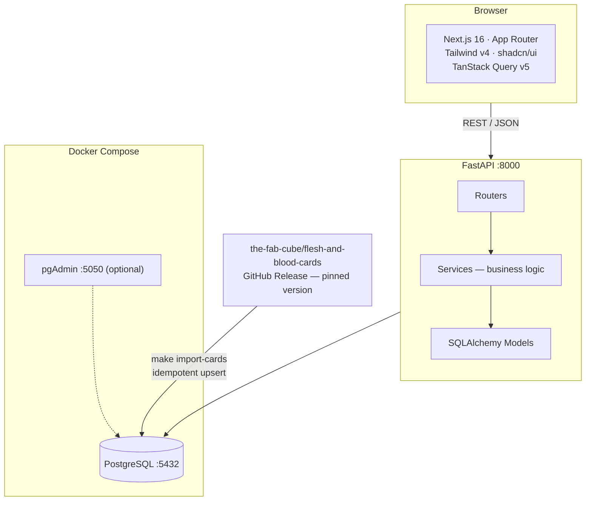
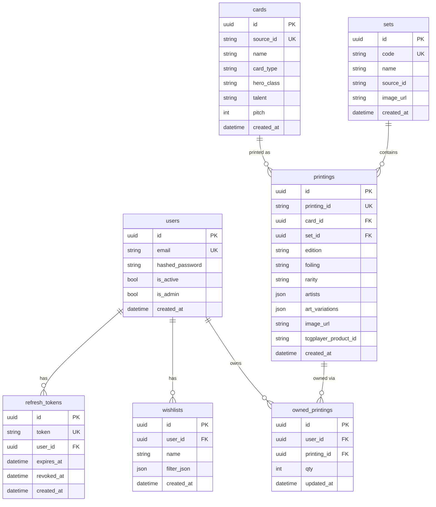

# FabGreat Library

> A full-stack Flesh & Blood TCG collection tracker built as a personal portfolio project.


Users can browse the full card catalog (92 sets, 4,200+ cards, 14,000+ printings), track which copies they own down to foiling and edition, manage their collection via single-click increment or atomic bulk updates, and browse missing printings with saved wishlist filters.

**Full stack — backend and frontend both complete.**

---

## Engineering highlights

- **Async throughout** — FastAPI + SQLAlchemy 2.0 async engine + asyncpg; no sync blocking anywhere in the request path.
- **JWT + refresh token rotation** — short-lived access tokens (15 min) paired with opaque DB-stored refresh tokens; logout revokes the token server-side.
- **Idempotent dataset import** — `make import-cards` downloads ~34 MB from a pinned GitHub release and upserts ~14,000 printings using `INSERT … ON CONFLICT DO UPDATE`. Safe to re-run at any time.
- **Atomic bulk mutations** — `POST /collection/bulk` validates all referenced printings exist before touching any row; the entire batch succeeds or nothing changes.
- **Server-state management** — TanStack Query (React Query v5) handles caching and invalidation; after any mutation the affected collection and set completion bars refresh automatically.
- **OpenAPI-first contract** — backend is the single source of truth; TypeScript types are generated from the OpenAPI schema, eliminating manual type duplication.
- **Strict test isolation** — each test opens a transaction that is rolled back on teardown; `db.commit` is patched to `db.flush` so route-level commits stay within the test transaction and never touch the real DB state.
- **Free-tier gate** — the wishlist limit (max 1 per user) is enforced in the service layer and surfaces as HTTP 402; deleting the existing wishlist re-opens the slot.

---

## Architecture



---

## Data model



**Key design decision — Strategy B:** the source dataset represents each foiling of a card as a separate entry. The `printings` table mirrors this directly: one row = one specific foiling + edition combination. Ownership is tracked by `(user_id, printing_id)` with no need for a separate foil-type column.

---

## API

<details>
<summary><strong>Auth</strong></summary>

| Method | Path | Auth | Description |
|---|---|---|---|
| POST | `/auth/register` | — | Create account, returns access + refresh tokens |
| POST | `/auth/token` | — | Login (OAuth2 password flow) |
| POST | `/auth/refresh` | — | Rotate refresh token |
| POST | `/auth/logout` | Bearer | Revoke refresh token server-side |
| GET | `/auth/me` | Bearer | Current user profile |

</details>

<details>
<summary><strong>Card catalog (public)</strong></summary>

| Method | Path | Description |
|---|---|---|
| GET | `/sets` | All sets with `printing_count`; adds `owned_count` when authenticated |
| GET | `/sets/{id}/printings` | Printings in a set — paginated, filterable by `q`, `rarity`, `foiling`, `edition`, `hero_class`, `talent`, `card_type` |
| GET | `/cards` | Card list — filterable by `name`, `hero_class`, `talent`, `pitch`, `set_code` |
| GET | `/cards/{id}` | Card detail with all printings and set info |
| GET | `/search/printings` | Cross-set printing search with all filters above |

</details>

<details>
<summary><strong>Collection (requires auth)</strong></summary>

| Method | Path | Description |
|---|---|---|
| GET | `/collection/summary` | Owned printings with full card/set detail; `?set_id=` to scope to one set |
| POST | `/collection/items` | Upsert `{printing_id, qty}` — qty 0 deletes the row |
| POST | `/collection/bulk` | Atomic batch with actions: `set_qty` · `increment` · `mark_playset` (qty=3) · `clear` |

</details>

<details>
<summary><strong>Missing &amp; Wishlists (requires auth)</strong></summary>

| Method | Path | Description |
|---|---|---|
| GET | `/missing` | Paginated printings not yet owned; filterable by `set_id`, `card_id`, `edition`, `foiling`, `rarity`, `artists` |
| POST | `/wishlists` | Save a named filter (returns 402 if one already exists — free tier limit) |
| GET | `/wishlists` | List saved wishlists for the current user |
| DELETE | `/wishlists/{id}` | Delete a wishlist (enables creating a new one) |

</details>

Interactive docs available at **http://localhost:8000/docs** when running locally.

---

## Tech stack

| Layer | Technology |
|---|---|
| API framework | FastAPI 0.100+ |
| ORM | SQLAlchemy 2.0 (fully async) |
| Database | PostgreSQL 15 via asyncpg |
| Migrations | Alembic |
| Auth | python-jose (JWT) + bcrypt |
| Validation | Pydantic v2 |
| Frontend | Next.js 16 (App Router) |
| Styling | Tailwind CSS v4 + shadcn/ui v3 |
| Data fetching | TanStack Query v5 |
| Types | Generated from OpenAPI via openapi-typescript |
| Testing | pytest-asyncio — 92 tests |
| Containerisation | Docker Compose |

---

## Getting started

**Prerequisites:** Python 3.11+, Node.js 20+, Docker Compose v2

### Step 1 — Environment

```bash
cp .env.example .env
cp apps/web/.env.local.example apps/web/.env.local
```

### Steps 2–5 — choose your terminal

| Step | `make` (Git Bash / Linux / macOS) | PowerShell (Windows) |
|---|---|---|
| Start Postgres | `make up` | `docker compose -f infra/docker/docker-compose.yml up -d` |
| Install deps | `make install` | `cd apps/api; python -m venv .venv; .venv\Scripts\pip install -e ".[dev]"` then `cd apps/web; npm install` |
| Run migrations | `make migrate` | `cd apps/api; .venv\Scripts\alembic upgrade head` |
| Import card data | `make import-cards` | `cd apps/api; .venv\Scripts\python -m scripts.import_cards` |
| Start API server | `make api-dev` | `cd apps/api; .venv\Scripts\uvicorn app.main:app --reload --port 8000` |
| Start web server | `make web-dev` | `cd apps/web; npm run dev` |
| Run tests | `make test` | `cd apps/api; .venv\Scripts\pytest -v` |

> Card import downloads ~34 MB from a pinned GitHub release and upserts ~14,000 printings. Safe to re-run.

---

## Project structure

```
FabGreatLibrary/
├── apps/
│   ├── api/                        FastAPI backend
│   │   ├── app/
│   │   │   ├── core/               Config, JWT, FastAPI dependencies
│   │   │   ├── db/                 ORM models (7 tables), async session
│   │   │   ├── routers/            auth · sets · cards · search · collection · missing · wishlist
│   │   │   ├── schemas/            Pydantic request/response models
│   │   │   └── services/           Business logic — no SQL in routers
│   │   ├── scripts/
│   │   │   ├── import_cards.py     Dataset importer (idempotent upsert)
│   │   │   └── seed.py             Dev seed data
│   │   ├── alembic/                DB migrations
│   │   └── tests/                  92 tests, per-test transaction rollback
│   └── web/                        Next.js 16 (App Router)
│       ├── app/
│       │   ├── page.tsx            Landing page
│       │   ├── login/page.tsx      Login form
│       │   ├── register/page.tsx   Registration form
│       │   ├── missing/page.tsx    Missing printings + wishlist panel
│       │   └── sets/
│       │       ├── page.tsx        Set grid with completion bars
│       │       └── [id]/page.tsx   Printings table, +1 increment, bulk actions
│       ├── components/
│       │   ├── navbar.tsx          Navigation + auth state
│       │   ├── providers.tsx       TanStack Query provider
│       │   └── ui/                 shadcn/ui components
│       └── lib/
│           ├── api.ts              API client — re-exports generated types + 11 fetch functions
│           └── auth.ts             Token helpers (localStorage)
├── packages/types/                 openapi.json + generated index.ts (source of truth for TS types)
├── infra/docker/                   docker-compose.yml
├── Makefile
└── .env.example
```

---

## Build progress

| Phase | Status | Deliverable |
|---|---|---|
| 0 — Scaffold | ✅ | Monorepo, Docker, Makefile, FastAPI skeleton, Next.js landing page |
| 1 — Domain | ✅ | ORM models, Alembic migrations, seed script, wishlist service |
| 2 — Auth | ✅ | Register, login, refresh token rotation, logout, `/me` |
| 3 — Catalog | ✅ | `GET /cards`, `GET /cards/{id}`, `GET /sets` |
| 4 — Browse | ✅ | Set printings, cross-set search, per-field filtering |
| 5 — Collection | ✅ | Backend: summary, upsert, atomic bulk · Frontend: set grid, +1 increment, bulk select |
| 6 — Missing / Wishlists | ✅ | `GET /missing`, wishlist CRUD (402 gate), missing page with save/load/delete |
| 7 — Types | ✅ | openapi-typescript generates `packages/types/index.ts` from FastAPI schema; `api.ts` re-exports via `@fabgreat/types` alias — no manual type duplication |
